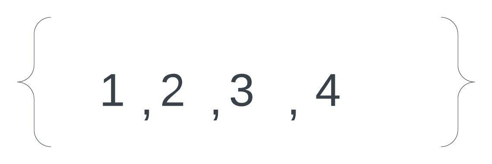
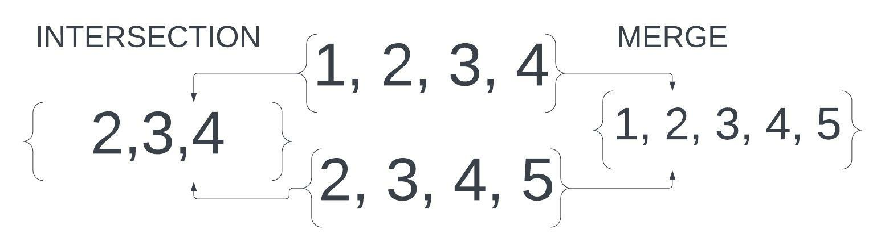

# Set

The Set is a very useful data structure that has amazing efficiencys. Set's hold unique values and have an impressive efficiency of O(1) in every 
regard thanks to a hash system that makes each item unique and capable of being accessed directly instead of itterating.
Sets are wonderful for holding data with unique values
Sets have no order due to each item being located at its hash value instead of at an index.

Here's and example of a set's basic structure:

A set has the following functions/methods and efficiencys: \
   .add(value) \
      adds a value to the set \
      O(1) efficiency, places a value at its given hash \
   .remove(value) \
      removes the value given from the set \
      O(1) efficiency, removes the value using its hash, no ittertion or shifting elements \
   .member(value) \
      finds out if a value is in a set \
      O(1) efficiency, checks the hash of the item for its presence \
      the python representation of this is the statement of : \
         if value in my_set \
   .size() \
      Returns the size of the Set \
      O(1) effieciency, Size of the set is storeed in a variable \
      The python representation of this is the statement: \
         length = len(set) 
    
In python we can also merge sets to get all the unique components of both, or intersect them to only keep the values that are in both. These two operations are called merge union and intersection. 

intersections are performed by: set = intersection(set1, set2) or set = set1 & set2 \
unions are formed by : set = union(set1, set2) or set = set1 | set2 \
    
    
