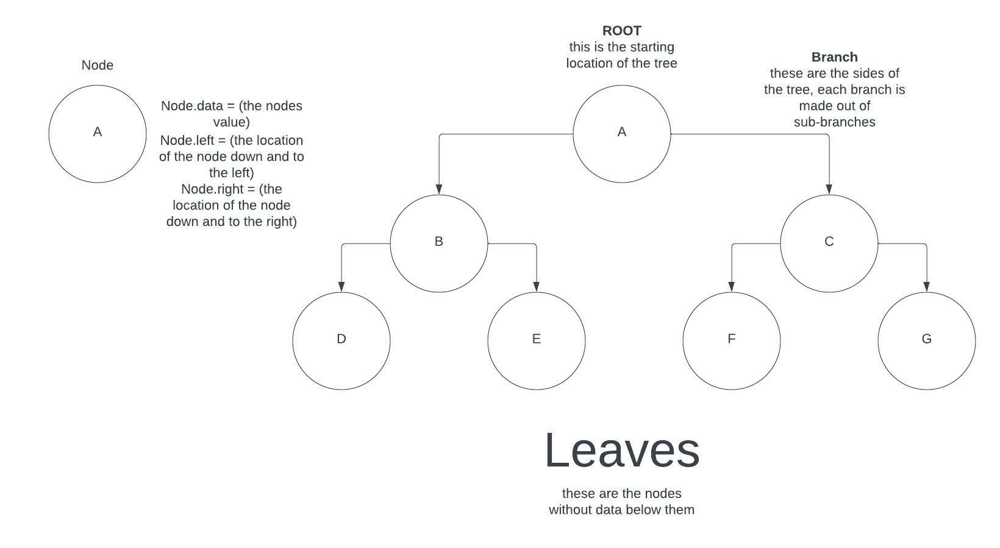
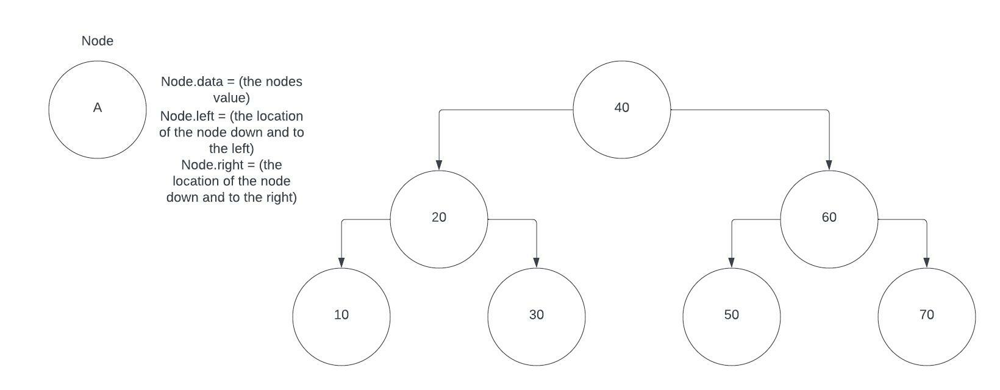
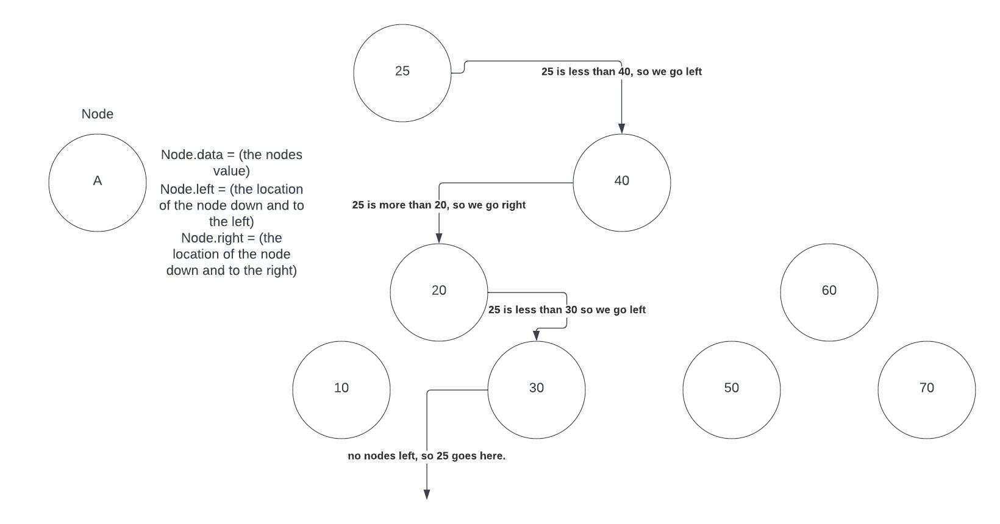

# Tree

There are several different types of the data structure of tree, but all of them have one similar structure. \
A tree is built from nodes. \
Nodes are objects within the tree that hold, the and different location of other nodes within there structure. 

This is an example of a tree's basic structure

Binary Search Tree

The binary search tree is one of the most common trees used and has many good applications. A binary search tree takes number values
and sorts them, so the we can receive the values we need with an efficiency of O(logn). In a binary search tree, the root is a value and 
if a value is less than the root, it is placed on the left, if it is more than the root it is placed on the right.

When adding a node to a BST it traveles down the tree checking its value against each node. If it is greater it goes right, if lesser it goes left, 
until it becomes one fo the leaves of the tree. Heres an example.

Inserting a BST is recursive, meaning it calls a function upon itself multiple times. To find what were looking for we must itterate through the nodes in the tree until we find our value, or find a location to place into the tree. 
